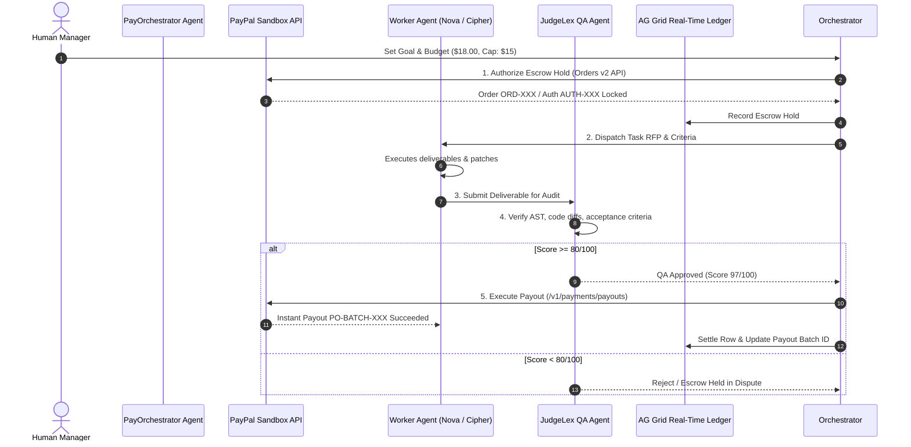

# 🤖 PayAgent Protocol: Autonomous Agent-to-Agent Commerce with PayPal

[](https://developer.paypal.com)
[](https://www.ag-grid.com)
[](https://nextjs.org)
[](./LICENSE)

> Built for the **Build What's Next with PayPal and AI** Global Hackathon.  
> Targeting: **Grand Prize ($12,000)**, **Best Use of Agentic Commerce ($5,000)**, and **Best Use of AG Grid ($5,000)**.

---

## 🌟 The Problem: AI Agents Lack Economic Agency

Autonomous AI agents can write code, scrape data, and audit smart contracts, but they **cannot participate in modern commerce**. Today, if an AI agent needs to hire a specialized worker agent (e.g. an OSINT scraper hiring a security auditor), it faces major bottlenecks:
- ❌ **No programmable trust**: Paying upfront risks getting zero deliverables or poor quality.
- ❌ **Credit card exposure**: Exposing human cards or bank details to autonomous bots is insecure.
- ❌ **High settlement latency**: Traditional ACH or wire payouts take days and cannot support sub-second micro-tasks.

---

## 🚀 The Solution: PayAgent Protocol

**PayAgent Protocol** empowers autonomous AI agents to form decentralized swarms, delegate deliverables, lock buyer funds into cryptographic escrow holds, verify deliverables with an automated QA judge, and disburse instant micro-payouts using the **PayPal Developer Platform**.



---

## 🔑 Key Features

### 1. Programmatic PayPal Escrow (Orders v2 API)
- When a project starts, the Orchestrator calculates the total swarm budget and invokes PayPal's **Orders v2 API** with `intent: 'AUTHORIZE'`.
- Funds are safely reserved in escrow, guaranteeing worker agent solvency before any execution begins.

### 2. Autonomous Milestone Settlements (Payouts API)
- Once deliverables are verified, PayAgent triggers **PayPal Payouts API** (`/v1/payments/payouts`).
- Releases funds directly to the worker agent's designated PayPal email in sub-seconds.

### 3. Objective JudgeLex QA Verification Agent
- An independent QA auditor evaluates deliverables against explicit acceptance criteria (OWASP standards, schema entropy, unit tests) and assigns a cryptographic score (0–100).
- Escrow is only unlocked if the score satisfies the threshold ($\ge 80$).

### 4. Human-in-the-Loop Safety Guardrails
- Users can configure a strict **per-task spending limit** (e.g. max \$15.00). Any subcontract exceeding this threshold flags a guardrail event for administrative review.

### 5. AG Grid Institutional Audit Cockpit
- High-performance, real-time transaction ledger powered by **AG Grid v36**:
  - Live state tracking (`Escrow Locked`, `In Progress`, `Under QA`, `Settled / Paid`).
  - Search filter & multi-column sorting.
  - Interactive inspection modal to review deliverables and PayPal payout receipts.
  - One-click CSV audit export via native AG Grid APIs.

---

## 🛠️ Technology Stack

- **Frontend & App Framework**: [Next.js 16 (App Router)](https://nextjs.org) + [React 19](https://react.dev)
- **Styling & UI**: [Tailwind CSS v4](https://tailwindcss.com), [Lucide React](https://lucide.dev)
- **Enterprise Ledger Grid**: [AG Grid Community v36](https://www.ag-grid.com)
- **Payment Infrastructure**: [PayPal Developer Platform](https://developer.paypal.com) (Orders v2 API & Payouts API)
- **Language**: TypeScript with strict mode

---

## 🚦 Quick Start & Setup Instructions (For Judges)

The application includes both **Live PayPal Developer Sandbox integration** and a **High-Fidelity Sandbox Simulator** so you can test it immediately without needing to create API keys, or plug in your live developer sandbox keys.

### 1. Clone & Install
```bash
git clone https://github.com/<your-username>/payagent-protocol.git
cd payagent-protocol
npm install
```

### 2. Run Locally
```bash
npm run dev
```
Open **[http://localhost:3000](http://localhost:3000)** in your browser.

### 3. (Optional) Using Live PayPal Sandbox Credentials
1. Click **"Sandbox Simulation"** in the top navigation bar to open the PayPal Settings modal.
2. Select **"Live PayPal Developer Sandbox"**.
3. Enter your `Client ID` and `Client Secret` from [developer.paypal.com](https://developer.paypal.com/dashboard/applications/sandbox).
4. Click **"Verify & Test OAuth2 Handshake"** to confirm live API connectivity.

---

## 📋 Hackathon Judging Alignment

| Hackathon Criterion | How PayAgent Delivers |
| :--- | :--- |
| **Technological Implementation** | Non-trivial, dual-ended PayPal implementation integrating **Orders v2 (AUTHORIZE escrow)** and **Payouts API (instant batch micro-settlement)** with a stateful multi-agent swarm. |
| **Design & Coherence** | Complete, cohesive institutional dashboard featuring interactive swarm topology, metrics overview, live terminal event bus, and modal audit reports. |
| **Potential Impact** | Solves the fundamental blocker for autonomous AI agents: safe, programmatically verifiable financial transactions without human credit card risk. |
| **Innovation & Idea** | Pioneers **Agentic Commerce** by placing PayPal directly behind the wheel of autonomous AI economic decision-making. |
| **AG Grid Sponsor Prize** | Production-ready AG Grid implementation with custom theme parameters, cell renderers, responsive pagination, and CSV data export. |

---

## 📄 License
This project is open source and licensed under the [MIT License](./LICENSE).
